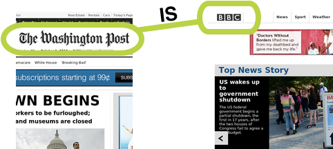
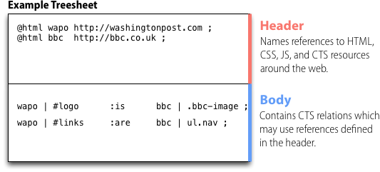

A treesheet is a set of relations between objects around the web. A relation can be thought of as an link between one piece of web content and another.

You might, for example, make a relation that says the logo of one newspaper is equivalent to the logo of another, as in the image below.

This relation, like all CTS relations, has three parts:

*  **Target Selector:** The Washington Post Logo
*  **Relation Type:** "IS"
*  **Source Selector:** The BBC Logo

Using this relation, we might swap the two logos. Or we can reason something about the two web pages so that we might combine them. As you'll see, this basic practice of drawing relations between web content enables a variety of functionality.

**But that's it** in terms of the abstract model. CTS is just a way to express relationships between web pages, and it does so using `<target, relation, source>` triples like the one above. The remainder of this document shows you the *syntax* for writing these triples and the way in which they are composed.

## Layout

A treesheet is made up of two parts: a **header** and a **footer**, shown in the figure below. The **header** is completely optional, and names references to resources around the web that are important for this treesheet. The **body** contains relations between those resources. If no resource is specified, the page currently loaded in the browser is always the default.

## Writing the CTS Header

Each line in the header begins with a command and ends with a semicolon. Some commands take arguments.

The following commands are supported:

*  `@html` - names and imports a HTML resource
*  `@css`  - imports a CSS resource
*  `@js` - imports a Javascript resource
*  `@cts` - imports a CTS resource
*  `@alias` - creates a resource for an existing named resource

### CSS, JS, and CTS

The `@css`, `@js`, and `@cts` commands simply instruct the CTS Engine to add a resource to the web page. In this way, the CTS header can be used as a dependency manager for the assets to be loaded to support the HTML on a page. 

For example, this CTS header command will cause the browser to load the [Twitter Bootstrap](http://getbootstrap.com) CSS. You can see a [live example of loading CSS with CTS](http://jsbin.com/UyeRaxU/3/edit).

    @css http://getbootstrap.com/2.3.2/assets/css/bootstrap.css;
    
And this CTS header command will cause the browser to load the [jQuery library](http://jquery.com). And here's a [live example of loading Javascript with CTS](http://jsbin.com/uSeLAG/7/edit).

    @js http://code.jquery.com/jquery-1.10.1.min.js;

So in summary, CTS can be used to manage all the other assets (CSS, CTS, Javascript) that a page relies on. This will come in handy later when you learn how to use CTS to craft web themes.

### HTML

The `@html` command imports a web document, but it loads it in memory for the CTS engine to use rather than adding it to the current web page. This command takes two arguments: a name and a URL.

The command will load a fragment of the WordPress Twenty-Thirteen blog theme, for example, giving it the name `theme` to us in CTS relations. This [jsBin snippet](http://jsbin.com/eMEVIre/6/edit) loads that HTML tree and dumps it into a text box for you to see.

    @html theme http://treesheets.csail.mit.edu/mockups/blog/twenty-thirteen/index.html;

Note that the `BODY` element of the document loaded in the browser always has the reserved name `body`, so no imported HTML tree can be given this name.

#### Note about CORS

Web browsers have strict policies when it comes to loading content from across different domains. These policies mean that you *can not load an HTML resource* from a domain other than the one your page is hosted on unless that other HTML page is being served with special HTTP headers turned on. These headers are called CORS headers, and give the browser permission to load the HTML from within some other web site.

### Aliasing

You can alias named trees (such as `@html` trees) with the `@alias` command:

    @html theme http://treesheets.csail.mit.edu/mockups/blog/twenty-thirteen/index.html;
    @html foo alias(theme);
    
Here's the [jsBin example from before](http://jsbin.com/EFolIMA/5/edit) but dumping the `foo` tree instead of the `theme` tree.

### Relative Paths

Any time you enter a URL into the header of a treesheet, you can use the `@relative(url)` command to construct a URL relative to the location from which the treesheet was loaded.

For example, if you loaded a treesheet from `http://example.org/themes/mytheme.cts` and that sheet had the following line:

    @css relative(mytheme.css);
    
It would resolve that URL relative to the treesheet URL, resulting in the following CSS being loaded:

    http://example.org/themes/mytheme.css
    
## Writing CTS Relations

After finishing any header commands, the rest of the treesheet is composed of relations. Each relation takes the following form:

    <Target Selector> <Relation Type> <Source Selector> ;

### Writing a Selector

A selector takes one of the following forms:

    SelectorString
    Tree | SelectorString
    Tree | SelectorString { Properties }
    SelectorString { Properties }

In other words, it is composed of a mandatory selector string with an optional `Tree` and `Properties` component.

For HTML trees, the SelectorString is a CSS selector. For example, the following selector refers to any nodes with the class `title` on a page:

    .title

Because no `Tree` has been specified, the default tree, `body` is assumed. This is the `BODY` element of the page loaded in your browser. You could refer to nodes with the `title` class on a different tree, though. For example, the `theme` tree we loaded in a prior example:

    theme | .title

What if you want to refer to a component of the HTML tree that CSS selectors can not talk about? That is one the `Properties` hash comes in useful: it provides a way to extend the selector language. The following selector selects the `href` attribute of all elements with the `title` class on the `theme` tree:

    theme | .title { attribute: href }
    
### Writing a Relation Type

A relation type is always preceded by a colon, and has an optional properties hash, like so:

    :is
    
or:

    :is { type: text }

Valid relation type are:

*  `:is`
*  `:are`
*  `:graft`
*  `:if-exist`
*  `:if-nexist`

## Attaching CTS to a Page

Treesheets can be attached to a page in three ways:

### Linked from the Head

    <link rel="treesheet" type="text/cts" href="filename.cts" />

### In a Style element

    

### Inline in an attribute

    

When you inline CTS into the `data-cts` attribute, the `this` keyword
represents the element on which the CTS is inlined.

