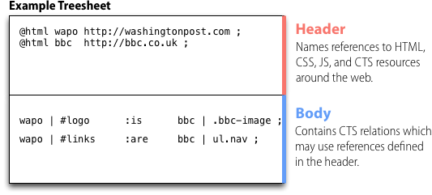

layout: page
---

# How to Write a Treesheet

A treesheet is a set of relations between objects around the web. A relation can be thought of as an link between one piece of web content and another.

You might, for example, make a relation that says the logo of one newspaper is equivalent to the logo of another, as in the image below.

This relation, like all CTS relations, has three parts:

*  **Target Selector:** The Washington Post Logo
*  **Relation Type:** "IS"
*  **Source Selector:** The BBC Logo

Using this relation, we might swap the two logos. Or we can reason something about the two web pages so that we might combine them. As you'll see, this basic practice of drawing relations between web content enables a variety of functionality.

**But that's it** in terms of the abstract model. CTS is just a way to express relationships between web pages, and it does so using `<target, relation, source>` triples like the one above. The remainder of this document shows you the *syntax* for writing these triples and the way in which they are composed.

## Layout

A treesheet is made up of two parts: a **header** and a **footer**, shown in the figure below. The **header** is completely optional, and names references to resources around the web that are important for this treesheet. The **body** contains relations between those resources. If no resource is specified, the page currently loaded in the browser is always the default.

## Writing a Header

Each line in the header begins with a command and ends with a semicolon. Some commands take arguments.

The following commands are supported:

*  `@html` - names and imports a HTML resource
*  `@css`  - imports a CSS resource
*  `@js` - imports a Javascript resource
*  `@cts` - imports a CTS resource
*  `@alias` - creates a resource for an existing named resource

### CSS, JS, and CTS

The `@css`, `@js`, and `@cts` commands simply instruct the CTS Engine to add a resource to the web page. In this way, the CTS header can be used as a dependency manager for the assets to be loaded to support the HTML on a page. 

For example, this CTS header command will cause the browser to load the [Twitter Bootstrap](http://getbootstrap.com) CSS. You can see a [live example of loading CSS with CTS](http://jsbin.com/UyeRaxU/3/edit).

    @css http://getbootstrap.com/2.3.2/assets/css/bootstrap.css;
    
And this CTS header command will cause the browser to load the [jQuery library](http://jquery.com). And here's a [live example of loading Javascript with CTS]().

    @js http://code.jquery.com/jquery-1.10.1.min.js;

### HTML

The `@html` command imports a web document, but it loads it in memory for the CTS engine to use rather than adding it to the current web page. This command takes two arguments: a name and a URL.

The command will load the BBC's homepage, for example, giving it the name `bbc` to us in CTS relations.

    @html bbc http://bbc.co.uk;

Note that the `BODY` element of the document loaded in the browser always has the reserved name `body`, so no imported HTML tree can be given this name.

#### Note about CORS

Web browsers have strict policies when it comes to loading content from across different domains. These policies mean that you *can not load an HTML resource* from a domain other than the one your page is hosted on unless that other HTML page is being served with special HTTP headers turned on. These headers are called CORS headers, and give the browser permission to load the HTML from within some other web site.

### Aliasing

### Relative Paths
